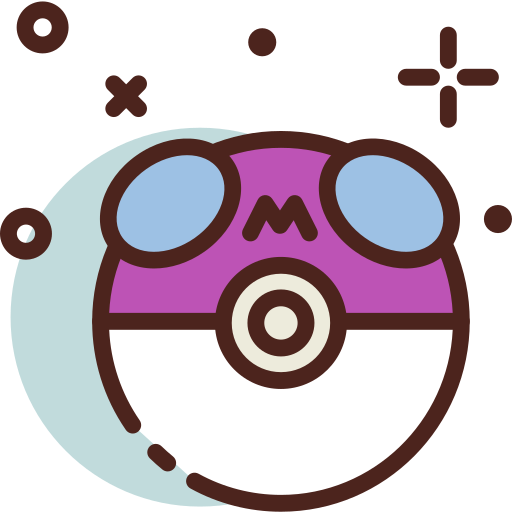

# PokeMaster

   

PokeMaster is Pokémon battle simulator using C++ with some reinforcement learning. The code is built on C++17 and can be compiled with commonly available compilers such as g++, clang++, or Microsoft Visual Studio. PokeMaster currently supports macOS (10.14 or later), Ubuntu (18.04 or later), Windows (Visual Studio 2017 or later), and Windows Subsystem for Linux (WSL). Other untested platforms that support C++17 also should be able to build PokeMaster.

## What is "Pokemon"?

**Pokémon** (English: /ˈpoʊkɪˌmɒn, -ki-, -keɪ-/), also known as **Pocket Monsters** in Japan, is a Japanese media franchise managed by the Pokémon Company, a company founded and with shares divided between Nintendo, Game Freak, and Creatures. The franchise copyright and Japanese trademark is shared by all three companies, but Nintendo is the sole owner of the trademark in other countries. The franchise was created by Satoshi Tajiri in 1995, and is centered on fictional creatures called "Pokémon", which humans, known as Pokémon Trainers, catch and train to battle each other for sport. The English slogan for the franchise is "Gotta Catch 'Em All". Works within the franchise are set in the Pokémon universe.

## Documentation

TBA

## How To Contribute

Contributions are always welcome, either reporting issues/bugs or forking the repository and then issuing pull requests when you have completed some additional coding that you feel will be beneficial to the main project. If you are interested in contributing in a more dedicated capacity, then please contact me.

## Contact

You can contact me via e-mail (utilForever at gmail.com). I am always happy to answer questions or help with any issues you might have, and please be sure to share any additional work or your creations with me, I love seeing what other people are making.

## License

The class is licensed under the [MIT License](http://opensource.org/licenses/MIT):

Copyright &copy; 2020 PokeMaster Team

  * [Chris Ohk](http://www.github.com/utilForever)
  * [Seungwoo Yoo](https://github.com/DveloperY0115)
  * [Seungwoo Lee](https://github.com/smilelee9)
  * [Eunsaem Ko](https://github.com/issaem)

Permission is hereby granted, free of charge, to any person obtaining a copy of this software and associated documentation files (the "Software"), to deal in the Software without restriction, including without limitation the rights to use, copy, modify, merge, publish, distribute, sublicense, and/or sell copies of the Software, and to permit persons to whom the Software is furnished to do so, subject to the following conditions:

The above copyright notice and this permission notice shall be included in all copies or substantial portions of the Software.

THE SOFTWARE IS PROVIDED "AS IS", WITHOUT WARRANTY OF ANY KIND, EXPRESS OR IMPLIED, INCLUDING BUT NOT LIMITED TO THE WARRANTIES OF MERCHANTABILITY, FITNESS FOR A PARTICULAR PURPOSE AND NONINFRINGEMENT. IN NO EVENT SHALL THE AUTHORS OR COPYRIGHT HOLDERS BE LIABLE FOR ANY CLAIM, DAMAGES OR OTHER LIABILITY, WHETHER IN AN ACTION OF CONTRACT, TORT OR OTHERWISE, ARISING FROM, OUT OF OR IN CONNECTION WITH THE SOFTWARE OR THE USE OR OTHER DEALINGS IN THE SOFTWARE.

© 2020 Pokémon. © 1995–2020 Nintendo/Creatures Inc./GAME FREAK inc. Pokémon, Pokémon character names, Nintendo Switch, Nintendo 3DS, Nintendo DS, Wii, Wii U, and WiiWare are trademarks of Nintendo. The YouTube logo is a trademark of Google Inc. Other trademarks are the property of their respective owners.